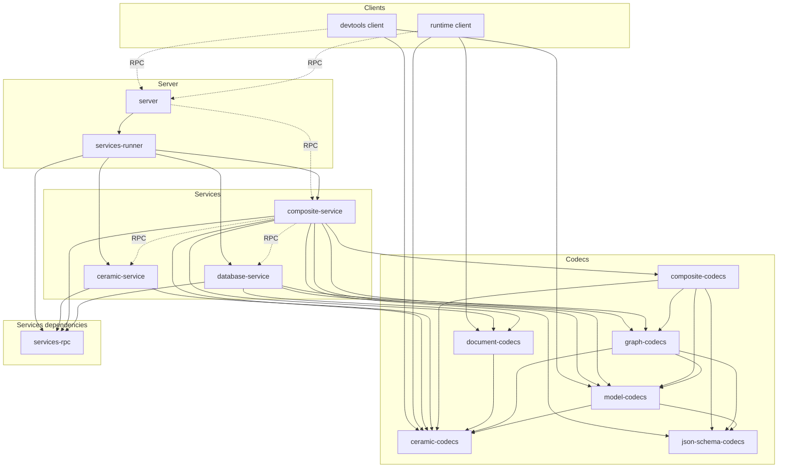

# Context

- Ceramic architecture > 3 years old, designed for isomorphism and stream types
  as public APIs
- ComposeDB different product than Ceramic, needs an architecture that matches
  its product needs
- ComposeDB “beta” is a PoC implementation hacked on top of Ceramic's
  constraints, not designed for production

# Architecture overview

## Services-based

- SOA for clear separation of concerns
- Shared messaging layer (RxJS Subject)

## RPC

- JSON-RPC communication between services (tRPC)

## Shared structures

- Codecs for shared data structures (io-ts)

## Scalability

- Can scale up (services running in different OS threads or even data centers)
  and down (single thread, low overhead)

## Reliability

- Services monitoring, interruption and restart

## Dependencies diagram

