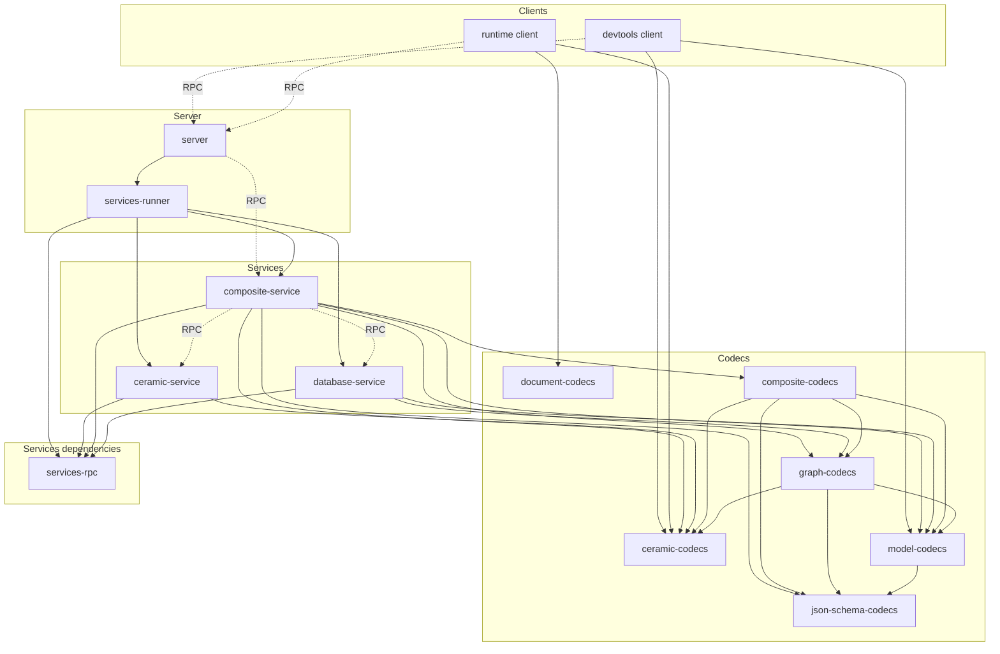

```mermaid
flowchart TD
  subgraph Clients
    DEVC[devtools client]
    RUNC[runtime client]
  end
  DEVC --> CERC & MODC
  RUNC --> CERC & DOCC

  subgraph Server
    SER[server]
    SRUN[services-runner]    
  end
  DEVC & RUNC -.->|RPC| SER
  SER --> SRUN
  SER -.->|RPC| COMS
  SRUN --> CERS & COMS & DBS & SRPC

  subgraph Services
    CERS[ceramic-service]
    COMS[composite-service]
    DBS[database-service]
    COMS -.->|RPC| CERS & DBS
  end
  CERS & COMS & DBS --> SRPC
  COMS --> CERC & COMC & JSSC & GRAC & MODC
  CERS --> CERC
  DBS --> GRAC & MODC

  subgraph Codecs
    CERC[ceramic-codecs]
    COMC[composite-codecs]
    DOCC[document-codecs]
    GRAC[graph-codecs]
    JSSC[json-schema-codecs]
    MODC[model-codecs]
  end
  COMC --> CERC & JSSC & GRAC & MODC
  GRAC --> CERC & JSSC & MODC
  MODC --> JSSC

  subgraph Services dependencies
    SRPC[services-rpc]
  end
```
