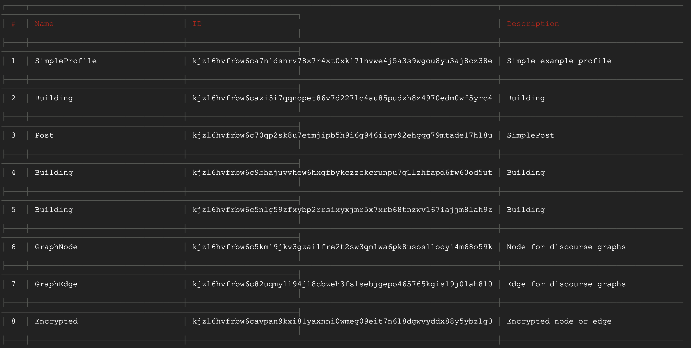

# ComposeDB Concepts
Learn about the ComposeDB graph database protocol and technology stack.

## Graph Database Protocol
---
In this section we will describe key aspects of the ComposeDB graph database protocol.

### Graph
ComposeDB is a composable property graph built on [Ceramic](https://ceramic.network/), where:

- **Nodes** are [accounts](#accounts) or [documents](#documents), each possessing a globally unique ID
- **Edges** are queryable [relationships](#account-to-model-relations)

### Accounts

Accounts are entities capable of owning and performing mutations on documents in the ComposeDB graph. Accounts usually represent end users, but they can be anything capable of signing a message such as groups, apps, devices, or services. Accounts perform ComposeDB mutations by submitting signed (authenticated) events to Ceramic. 

ComposeDB is built on Ceramic, so it relies on Ceramic's identity system for accounts and authentication. Ceramic implements the [Decentralized Identifiers (DIDs)](https://w3c.github.io/did-core/) protocol, a widely-adopted W3C standard for accounts. 

An example public DID identifier:

```
did:pkh:bafy123...56789
```
#### Authentication

ComposeDB goes beyond vanilla DIDs and provides a great UX with additional developer tooling. ComposeDB is compatible with the "Sign In with X" standard (e.g. Sign in with Ethereum, SIWE) and the DID Sessions library, which enables end users to initiate long-lived [sessions](./guides/composedb-client/user-sessions.mdx) from their existing blockchain wallet such as MetaMask or Phantom with only one signature, making Web3 authentication feel like Web2.

### Documents

A document is a single mutable instance of structured data in the ComposeDB graph. All documents must conform to a [model](#models) and be authored by an account. Updates to a document must also adhere to its model and can only be performed by its owner's account. ComposeDB APIs abstract away that documents are actually stored in Ceramic [streams](https://developers.ceramic.network/learn/advanced/overview/#streams).

### Models
Models contain metadata and GraphQL schemas for documents. All documents must be based on a model. Models are designed to be plug-and-play so they can easily be reused by ComposeDB application developers, removing the burden of data modeling. When multiple applications reuse the same model, they also share access to the same documents (data set) on the ComposeDB graph, enabling data composability and reuse. Like documents, models are stored in Ceramic streams; however unlike documents, models are immutable. 

#### Modeling Basics

Models are stored in a `.graphql` file and written using a subset of the [GraphQL Schema Definition Language (SDL)](./api/sdl/scalars.mdx). Within a model, it is possible to define specific properties that store relations to other models or accounts. When using the model, it's possible to perform queries based on these relations. See [Introduction to Modeling](./guides/data-modeling/introduction-to-modeling.mdx) to learn the basics of writing models.

An example `Post` model, whose documents would store social posts:

```graphql

type Posts @createModel(accountRelation: LIST, description: "A simple Post") {
  body: String! @string(minLength: 1, maxLength: 100)
  edited: DateTime
  created: DateTime!
  profileId: StreamID! @documentReference(model:"BasicProfile")
  profile: BasicProfile! @relationDocument(property: "profileId")
}

```
- `type` sets the name for the model, in this case `Post`
- `@createModel` is a directive to create a new model that takes `accountRelation` and `description` as parameters
- `accountRelation` sets max documents for each account, where `SINGLE` is one and `LIST` is unlimited
- `description` sets the description for the model


#### Account to Model Relations

Any document can always be queried by its author's account using the reqired `accountRelation` property. See [Account to Model Relations](./guides/data-modeling/relations.mdx#account-to-model-relations) for more.

##### Model

Here is a model that stores a `DisplayName` for a given user:

```graphql
type DisplayName @createModel(accountRelation: SINGLE, description: "Display name for a user") {
  displayName: String! @string(minLength: 3, maxLength: 50)
}
```

<!--- NEEDS PAUL EXAMPLE 

##### Query

Let's query the `DisplayName` using the author's account:

```graphql


```

-->

#### Model to Account Relations

Enable a document to be queried by a referenced account using the `@accountReference` directive. See [Model to Account Relations](./guides/data-modeling/relations.mdx#model-to-account-relations) for more.

##### Model

Here is a model, `Message`, that stores a direct message (DM) sent from one user to another:

```graphql
type Message @createModel(accountRelation: LIST, description: "Direct message model") {
  recipient: DID! @accountReference
	directMessage: String! @string(minLength: 1, maxLength: 200)
}
```

<!--- NEEDS PAUL EXAMPLE 

##### Query

Let's query messages based on recipient using `@accountReference`:

```graphql


```

-->

#### Model to Model Relations

Enable a document to be queried by its relationship to other documents using the `@documentReference` and `@relationFrom` directives. See [Model to Model Relations](./guides/data-modeling/relations.mdx#model-to-model-relations) for more.

##### Model

Here are the models that enable comments to be made on a post. It supports unlimited comments per user, and bi-directional queries from any comment to the original post and from the original post to all of its comments.

```graphql
# Load post model (using streamID)

type Post @loadModel(id: "kjzl6hvfrbw6c99mdfpjx1z3fue7sesgua6gsl1vu97229lq56344zu9bawnf96"){
    id: ID!
}

# New comment model
# Set relationship to original post
# Enable querying comment to get original post

type Comment @createModel(accountRelation: LIST, description: "A comment on a Post") {
  postID: StreamID! @documentReference(model: "Post")
  post: Post! @relationDocument(property: "postID")
  text: String! @string(maxLength: 500)
}

# Load comment model

type Comment @loadModel(id: "kjzl6hvfrbw6c9oo2ync09y6z5c9mas9u49lfzcowepuzxmcn3pzztvzd0c7gh0") {
  id: ID!
}

# Load post model
# Extend post model with comments
# Set relationships to all comments
# Enable querying post to get all comments

type Post @loadModel(id: "kjzl6hvfrbw6c99mdfpjx1z3fue7sesgua6gsl1vu97229lq56344zu9bawnf96") {
  comments: [Comment] @relationFrom(model: "Comment", property: "postID")
}
```

### Composites

A composite is a group of one or more models (e.g. profiles, blog posts, comments) that defines the complete graph database schema for an application.  To be usable in your application, one or models need to be bundled into a composite. Composites have three representations used throughout the ComposeDB stack:

| Representation  | Usage  |
|---|---|
|__Composite__| The base composite containing a collection of models encoded in JSON  |
|__Deployed Composite__| Once deployed, instructs a node which documents to index based on the composite's models |
|__Compiled Composite__| Once compiled, enables client to query and mutate documents based on the composite's models |

## Core Components 
---

Learn about the software components that power ComposeDB technology.

### ComposeDB Server

As mentioned earlier, ComposeDB is a decentralized property graph database built on top of [Ceramic](https://ceramic.network). A ComposeDB server is actually just a Ceramic node backed by a SQL database which stores an index of ComposeDB documents based on the models contained in a composite. The index database provides fast access and high-performance queries against documents in the ComposeDB graph without suffering from performance limitations of decentralization. 

Although each ComposeDB server decides which documents it wants to index, all ComposeDB servers are networked and replicate data across the Ceramic network which acts as a global syncing protocol. Your local database state is built up from a global network of cryptographically-verifiable documents and models, allowing you to trust the integrity of your index.

Today, all ComposeDB developers need to run their own server to ensure data availability. However various hosted node providers are emerging in the ecosystem to provide this functionality as a service. Down the road, Ceramic plans to implement crytoeconomic guarantees around data availability.

Here's an overview of services running in a ComposeDB server:

| Service  | Description  |
|---|---|
|__Database__| SQL database used to store an index of ComposeDB documents |
|__Ceramic__| Decentralized event streaming infrastructure used to store ComposeDB models and documents |
|__IPFS__| Low-level peer-to-peer data protocols used by Ceramic |

### ComposeDB Client

[ComposeDB client](./guides/composedb-client/composedb-client.mdx) is a relatively simple software library that connects your application to a ComposeDB server. It is written in JS/TS and exposes a GraphQL interface that enables your application to perform GraphQL queries and mutations against a ComposeDB server. The client needs to be passed a compiled composite in order to saturate its own APIs and understand the schemas for the models you’re using.

### Model Catalog

As mentioned earlier, composites and their underlying data models are designed to be reusable, making it simple to build complementary and interoperable apps. Apps that reuse each other's models create instant data interoperability, without any additional integrations needed. 

The [Model Catalog](./guides/data-modeling/model-catalog.mdx) allows developers to discover, share and reuse data models, enabling data composability across applications within the ComposeDB ecosystem. All models contained in deployed composites are automatically added to the catalog.

#### Catalog Interfaces
Currently, discovering models in the catalog happens through commands in the ComposeDB CLI. However, we're looking for people in the community to create great products and user interfaces for interacting with the catalog.



## Next Steps
---
Ready to dive deeper? Head to [**Next Steps →**](./next-steps.mdx)
